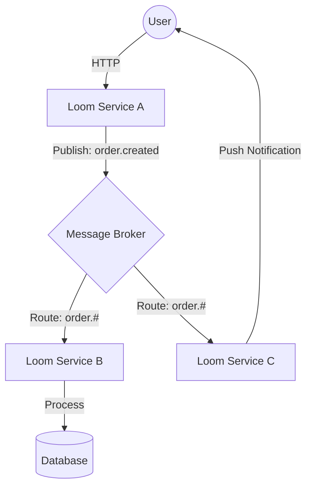
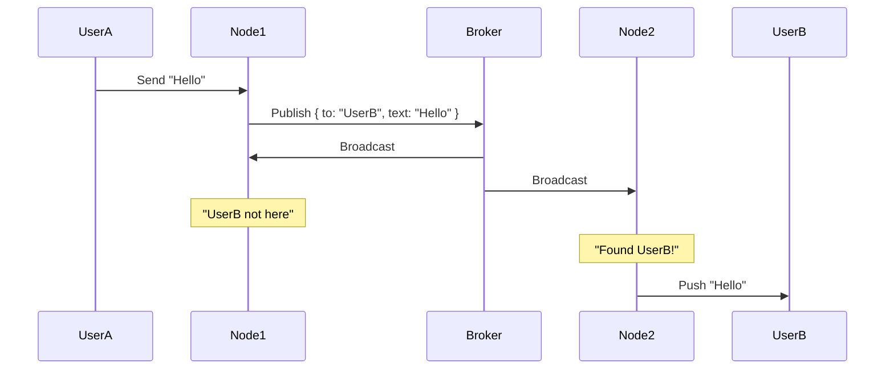

# Event System Architecture

> **Namespace**: `[Loom]::[Event System]` > **Module**: `BusModule` (Internal) / `BrokerModule` (External)

The **Events Adapter** is the nervous system of the Link Loom architecture. It provides two distinct layers of communication: **Internal Reactivity** (Observer Pattern) and **Distributed Messaging** (Broker Pattern).

## 1. Layer 1: The Internal Bus (In-Memory)

- **Scope**: Single Process (Instance).
- **Mechanism**: Node.js `EventEmitter`.
- **Purpose**: Decoupling modules within the same service (e.g., API $\to$ Functions).

(See [Internal Consumer Pattern](#internal-consumer-pattern) below).

## 2. Layer 2: The External Broker (Distributed)

- **Scope**: Cluster / Global.
- **Mechanism**: `RabbitMQ` / `Redis` / `NATS` (via Providers).
- **Purpose**: Enabling **Machine-to-Machine (M2M)** communication and **Real-Time Systems** (Chat, Notifications).

### Architecture: The "Loom Network"

In a microservices or distributed environment, multiple Link Loom instances ("Nodes") communicate via the Broker.



## 3. The Broker Manifest (`src/events/index.js`)

Unlike the internal bus which is ad-hoc, the Broker requires a strict **Declarative Manifest**. This defines the topology of your event network.

### Structure

```javascript
/* src/events/index.js */
module.exports = {
  // 1. PRODUCER: What can I say?
  producer: {
    topics: [{ name: 'chatbot' }, { name: 'billing' }],
    events: [
      {
        name: 'app.chat.message', // The Routing Key
        command: '#send', // Semantic Action
        topics: ['chatbot'], // Topic Binding
        filename: '/events/producer/chat/message.event', // Validation Schema
      },
    ],
  },

  // 2. CONSUMER: What do I listen to?
  consumer: {
    events: [
      {
        name: 'app.billing.invoice', // Listen for this key
        command: '#paid', // Filter for this action
        topics: ['billing'], // Subscribe to this topic
        filename: '/events/consumer/billing/invoice-paid.event', // Handler Logic
      },
    ],
  },
};
```

### Key Concepts

- **Topic**: A logical channel (e.g., `chatbot`). Services subscribe to Topics.
- **Event Name (Routing Key)**: A hierarchical dot-separated identifier (e.g., `app.chat.message`).
- **Command**: A suffix used to differentiate intent (e.g., `#request` vs `#response`).

## 4. Use Case: Real-Time Chat System

The Broker is essential for Chat architectures where users might be connected to different HTTP/WebSocket nodes.

**The Flow:**

1.  **User A** sends message "Hello" to `Node 1` via HTTP/WS.
2.  `Node 1` **Produces** `app.chat.message` to the `chatbot` topic.
3.  **The Broker** broadcasts this message to _all_ subscribed nodes (`Node 1`, `Node 2`, `Node 3`).
4.  Each Node **Consumes** the event.
5.  Each Node checks if the recipient (User B) is connected to it.
6.  `Node 3` finds User B and pushes the message via WebSocket.



## 5. Machine-to-Machine (M2M)

For backend communication (e.g., Orchestrator triggering a Worker), rely on the Broker to ensure **Location Transparency**. Pass DTOs (Data Transfer Objects), not shared memory references.

### Consumer Implementation

External consumers differ from internal ones. They receive the **Message Context**.

```javascript
class ChatConsumer {
  async run({ payload, ack, nack }) {
    try {
      await this.processMessage(payload);
      ack(); // Acknowledge receipt (removes from Queue)
    } catch (e) {
      nack(); // Negative Ack (re-queue or DLQ)
    }
  }
}
```
