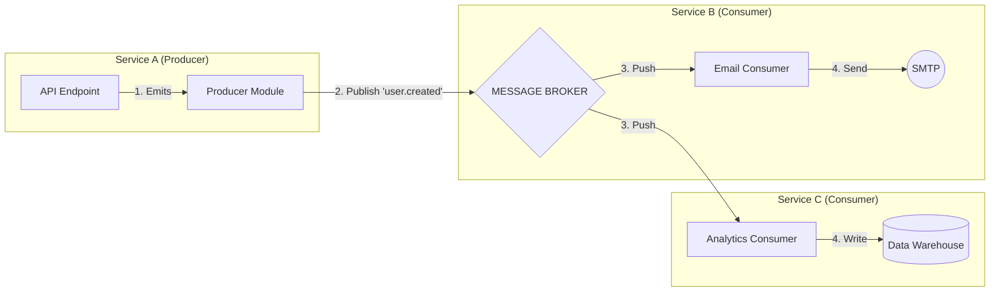
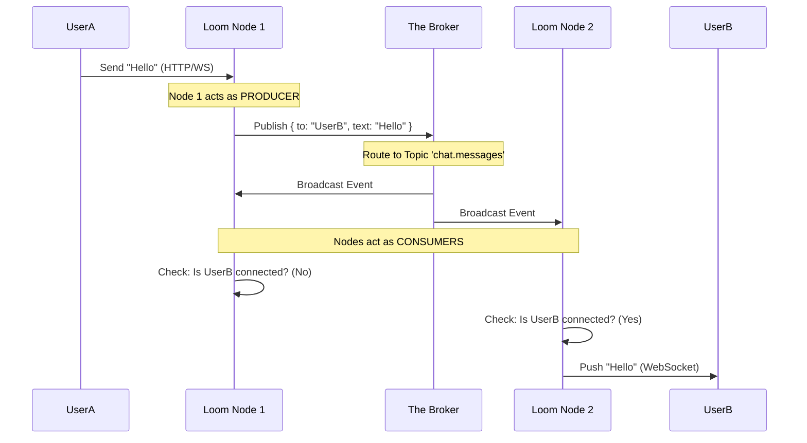

# Event System Architecture

> **Namespace**: `[Loom]::[Event System]` > **Module**: `BusModule` (Internal) / `BrokerModule` (External)

The **Events Adapter** is the nervous system of the Link Loom architecture. It implementation follows a strict **Event-Driven Architecture (EDA)** that scales from simple in-process reactivity to complex, distributed event meshes.

## 1. Layers of Communication

Loom provides two distinct layers, preventing the "Distributed Monolith" anti-pattern by strictly separating local coupling from domain decoupling.

| Layer       | Component           | Mechanism            | Scope            | Latency      |
| :---------- | :------------------ | :------------------- | :--------------- | :----------- |
| **Layer 1** | **Internal Bus**    | `EventEmitter`       | Single Process   | Microseconds |
| **Layer 2** | **External Broker** | `RabbitMQ` / `Redis` | External Cluster | Milliseconds |

---

## 2. Layer 2: The Broker Architecture (Kafka Pattern)

For external communication, Link Loom adopts the **Producer-Broker-Consumer** pattern found in systems like Apache Kafka. This architecture allows for massive horizontal scaling and "Location Transparency"—neither the sender nor the receiver needs to know about the other's existence or physical location.

### The Three Roles

#### Role A: The Producer ("The Publisher")

- **Definition**: Any service or component that emits a signal that "something changed".
- **Responsibility**: Generating the event payload and assigning it a **Topic** and **Routing Key**.
- **Location**: `src/events/producer/`
- **Behavior**: Fire-and-forget (from the code's perspective), although the SDK handles delivery guarantees to the Broker.

#### Role B: The Broker ("The Hub")

- **Definition**: The infrastructure piece (RabbitMQ, Redis Stream, Kafka) that governs the message flow.
- **Responsibility**:
  - **Durability**: Ensuring messages aren't lost if consumers are down.
  - **Routing**: Distributing one message to one (P2P) or many (Pub/Sub) consumers.
  - **Buffering**: Handling backpressure when producers outpace consumers.
- **Abstraction**: In Loom, you never touch the Broker driver directly; you interact with the `BrokerModule`.

#### Role C: The Consumer ("The Subscriber")

- **Definition**: A worker that reacts to specific events.
- **Responsibility**: Executing a side-effect (DB write, Email send) and acknowledging the message.
- **Location**: `src/events/consumer/`
- **Behavior**:
  - **ACK**: "I finished processing. Remove from queue."
  - **NACK**: "I failed. Retry later." (Reliability).

---

## 3. Architecture Diagrams

### Flow 1: Simple Decoupling (Pub/Sub)

A classic "One-to-Many" broadcast.



### Flow 2: Complex Chat System (The "Loom Network")

Real-time routing where the Broker acts as the synchronization layer for a cluster of WebSocket nodes.



---

## 4. The Event Manifest (`src/events/index.js`)

To keep this complexity manageable, Loom requires a strict **Declarative Manifest**. This file acts as the "Contract" for your service's event IO.

```javascript
module.exports = {
  // ROLE: PRODUCER
  producer: {
    topics: [{ name: 'billing' }], // Infrastructure provisioning
    events: [
      {
        name: 'app.order.created', // Routing Key
        topics: ['billing'], // Destination Topic
        filename: '/events/producer/order/created.event', // Schema
      },
    ],
  },

  // ROLE: CONSUMER
  consumer: {
    events: [
      {
        name: 'app.order.refunded', // Listening for this
        topics: ['billing'], // On this channel
        filename: '/events/consumer/order/refunded.event', // Using this Logic
      },
    ],
  },
};
```

## 5. Consumer Implementation Pattern

Consumers in Loom receive a `context` object containing the payload and control functions, mirroring Kafka's acknowledgment mechanisms.

```javascript
/* src/events/consumer/order/refunded.consumer.js */
class RefundConsumer {
  /**
   * @param {Object} input
   * @param {Object} input.payload - The data sent by the producer
   * @param {Function} input.ack - Positive Acknowledgement (Commit)
   * @param {Function} input.nack - Negative Acknowledgement (Re-queue)
   */
  async run({ payload, ack, nack }) {
    try {
      await this.processRefund(payload);
      ack(); // Critical: Tell Broker we are done
    } catch (error) {
      console.error(error);
      nack(); // Critical: Tell Broker to retry
    }
  }
}
```
