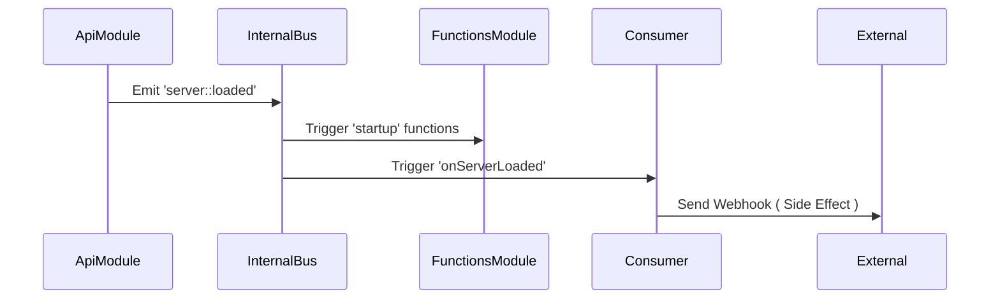

# Event System Architecture

> **Namespace**: `[Loom]::[Event System]` > **Module**: `BusModule`

The **Events Adapter** implements the **Observer Pattern** for internal communication and the **Broker Pattern** for external communication.

## 1. Directory Structure

In a Link Loom service (`loom-svc-js`), event logic is split by role:

```
src/events/
├── consumer/       # Listeners (React to events)
│   ├── server/     # System events (boot, shutdown)
│   └── domain/     # Business events (user.created)
├── producer/       # Emitters (Fire events)
└── index.js        # Manifest
```

## 2. The Consumer Pattern

A Consumer is a class responsible for creating side effects in response to an event.

### Implementation

```javascript
/* src/events/consumer/server/boot.consumer.js */
class BootConsumer {
  constructor(dependencies) {
    this._bus = dependencies.eventBus.bus; // Layer 1: Internal Bus
    this._console = dependencies.console;
  }

  /**
   * Called automatically during 'ignite' phase if listed in manifest.
   */
  setup() {
    // Subscription
    this._bus.on('server::loaded', this.onServerLoaded.bind(this));
  }

  onServerLoaded(payload) {
    // Reaction
    this._console.info('System is Ready. Sending heartbeat...');
    // ... logic ...
  }
}
```

## 3. Communication Layers

### Layer 1: Internal Bus (Synchronous/process-local)

- **Transport**: Native `EventEmitter`.
- **Use Case**: Functional reactivity.
  - _Example_: `ApiModule` finishes loading $\rightarrow$ emits `server::event-bus::loaded` $\rightarrow$ `FunctionsModule` starts Cron Scheduler.

### Layer 2: External Broker (Async/Distributed)

- **Transport**: Socket.io / RabbitMQ (via `ProducerModule`).
- **Use Case**: Domain decoupled logic.
  - _Example_: `OrderService` emits `order.paid` $\rightarrow$ Broker $\rightarrow$ `WarehouseService` reserves stock.

## 4. Event Manifest (`src/events/index.js`)

Consumers are not auto-discovered to avoid side effects. They must be explicitly registered.

```javascript
module.exports = {
  consumer: [
    {
      name: 'BootHandler',
      path: 'events/consumer/server/boot.consumer',
    },
  ],
  producer: [],
};
```

## 5. Architectural Flow


