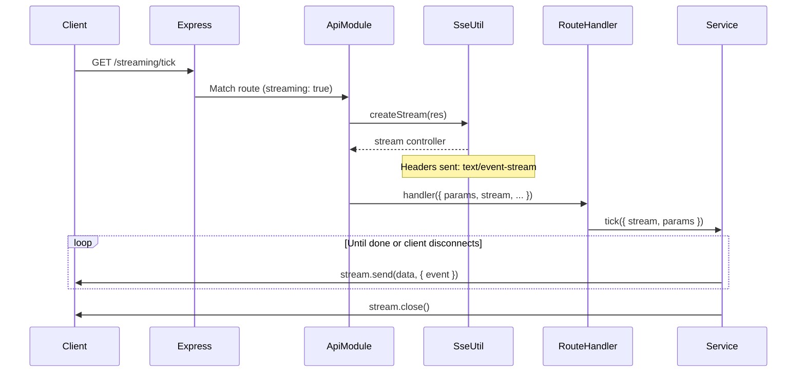

# Server-Sent Events (SSE)

> **Namespace**: `[Loom]::[Adapter]::[HTTP]::[SSE]` > **Utility**: `utilities.sse` > **Dependencies**: `express`

**SSE** enables real-time, unidirectional server-to-client push over standard HTTP. Unlike WebSockets, SSE uses a plain HTTP connection with `text/event-stream` content type, making it ideal for push notifications, progress updates, live feeds, and streaming responses.

## 1. Route Configuration

SSE endpoints are declared like any other route, with the addition of the `streaming: true` flag.

### Endpoint Definition

```javascript
/* src/routes/api/streaming/streaming.routes.js */
module.exports = {
  streaming: [
    {
      method: 'GET',
      httpRoute: '/tick',
      route: 'routes/api/streaming/streaming.route',
      handler: 'tick',
      protected: false,
      streaming: true,  // ← Activates SSE mode
    },
  ],
};
```

### Route Config Properties

| Property    | Type      | Description                                                     |
| :---------- | :-------- | :-------------------------------------------------------------- |
| `streaming` | `boolean` | When `true`, the handler receives a `stream` object in context. |

**Backward Compatibility**: Routes without `streaming: true` are completely unaffected. The standard JSON response flow remains unchanged.

## 2. The Stream Object

When `streaming: true` is set, the `ApiModule` creates an SSE stream via `utilities.sse.createStream(res)` and injects it into the handler context as `ctx.stream`.

### Extended Context

| Property      | Source                    | Description                          |
| :------------ | :------------------------ | :----------------------------------- |
| `ctx.params`  | Merged request parameters | Same as standard routes.             |
| `ctx.headers` | `req.headers`             | Same as standard routes.             |
| `ctx.req`     | Express request           | Same as standard routes.             |
| `ctx.res`     | Express response          | Same as standard routes.             |
| `ctx.stream`  | `SseUtil.createStream()`  | SSE stream controller (SSE only).    |

### Stream API

#### `stream.send(data, options?)`

Send a named SSE event with JSON-serializable data.

| Param            | Type     | Required | Description                                     |
| :--------------- | :------- | :------- | :---------------------------------------------- |
| `data`           | `any`    | Yes      | JSON-serializable payload.                      |
| `options.event`  | `string` | No       | Named event type (client uses `addEventListener`). |
| `options.id`     | `string` | No       | Event ID for `Last-Event-ID` reconnection.      |
| `options.retry`  | `number` | No       | Reconnection interval in milliseconds.          |

```javascript
stream.send({ progress: 50 }, { event: 'progress', id: '5' });
```

#### `stream.comment(text)`

Send an SSE comment (`:text`). Comments are ignored by `EventSource` but keep the connection alive through proxies and load balancers.

```javascript
stream.comment('keep-alive');
```

#### `stream.close()`

Close the SSE stream gracefully. The client receives a connection close event.

```javascript
stream.close();
```

#### `stream.closed`

Read-only boolean. `true` when the client has disconnected or `stream.close()` has been called.

```javascript
if (stream.closed) return;
```

## 3. Implementation Pattern

### Route Class

```javascript
class StreamingRoute {
  constructor(dependencies) {
    this._dependencies = dependencies;
    this._services = dependencies.services;
    this.EntityService = this._services.StreamingService;
  }

  async tick(ctx) {
    const entityService = new this.EntityService(this._dependencies);
    return entityService.tick(ctx);
  }
}
```

### Service Class

```javascript
class StreamingService {
  constructor(dependencies) {
    this._utilities = dependencies.utilities;
    this._console = dependencies.console;
  }

  async tick({ stream, params }) {
    if (!stream) {
      return this._utilities.io.response.error('Stream not available');
    }

    const count = parseInt(params?.count, 10) || 5;

    stream.send({ total: count }, { event: 'open' });

    for (let i = 1; i <= count; i++) {
      if (stream.closed) break;
      await new Promise((r) => setTimeout(r, 1000));
      stream.send({ index: i }, { event: 'tick', id: String(i) });
    }

    stream.send({ message: 'done' }, { event: 'done' });
    stream.close();
  }
}
```

## 4. Lifecycle



## 5. Error Handling

The `ApiModule` wraps the streaming handler in a try/catch. If the handler throws:

1. An `error` event is sent to the client with the error message.
2. The stream is closed.

```javascript
// Automatic error handling by ApiModule:
try {
  await route[endpoint.handler]({ params, req, res, headers, stream });
} catch (error) {
  if (!stream.closed) {
    stream.send({ success: false, message: error.message }, { event: 'error' });
    stream.close();
  }
}
```

Services should also handle errors internally for graceful degradation.

## 6. Protected Streaming Routes

SSE works with `protected: true`. JWT validation occurs **before** the stream is created:

```javascript
{
  method: 'GET',
  httpRoute: '/live-updates',
  route: 'routes/api/updates/updates.route',
  handler: 'stream',
  protected: true,    // JWT validated first
  streaming: true,    // Then SSE stream created
}
```

## 7. Client-Side Usage

### Browser (EventSource)

```javascript
const source = new EventSource('/streaming/tick?count=10');

source.addEventListener('tick', (e) => {
  const data = JSON.parse(e.data);
  console.log('Tick:', data.index);
});

source.addEventListener('done', (e) => {
  console.log('Completed');
  source.close();
});

source.onerror = () => console.log('Connection lost');
```

### Node.js (http)

```javascript
const http = require('http');

http.get({ hostname: 'localhost', port: 3601, path: '/streaming/tick' }, (res) => {
  res.on('data', (chunk) => process.stdout.write(chunk.toString()));
  res.on('end', () => console.log('[stream ended]'));
});
```

## 8. Compression

SSE responses automatically bypass compression:

- **`Content-Type: text/event-stream`** is excluded by the `compression` middleware by default.
- **`X-Accel-Buffering: no`** disables buffering in nginx and similar reverse proxies.
- **`Cache-Control: no-cache`** prevents intermediate caching.

## 9. SSE vs WebSocket vs Polling

| Feature           | SSE                 | WebSocket           | Polling             |
| :---------------- | :------------------ | :------------------ | :------------------ |
| Direction         | Server → Client     | Bidirectional       | Client → Server     |
| Protocol          | HTTP                | WS                  | HTTP                |
| Auto-reconnect    | Built-in            | Manual              | Manual              |
| Binary support    | No (text only)      | Yes                 | Yes                 |
| Proxy-friendly    | Yes                 | Sometimes           | Yes                 |
| Complexity        | Low                 | Medium              | Low                 |
| Best for          | Push, feeds, status | Chat, games, collab | Legacy, simple poll |

**Use SSE when** you need server-to-client push without bidirectional communication (progress bars, live dashboards, notification feeds, streaming AI responses).
