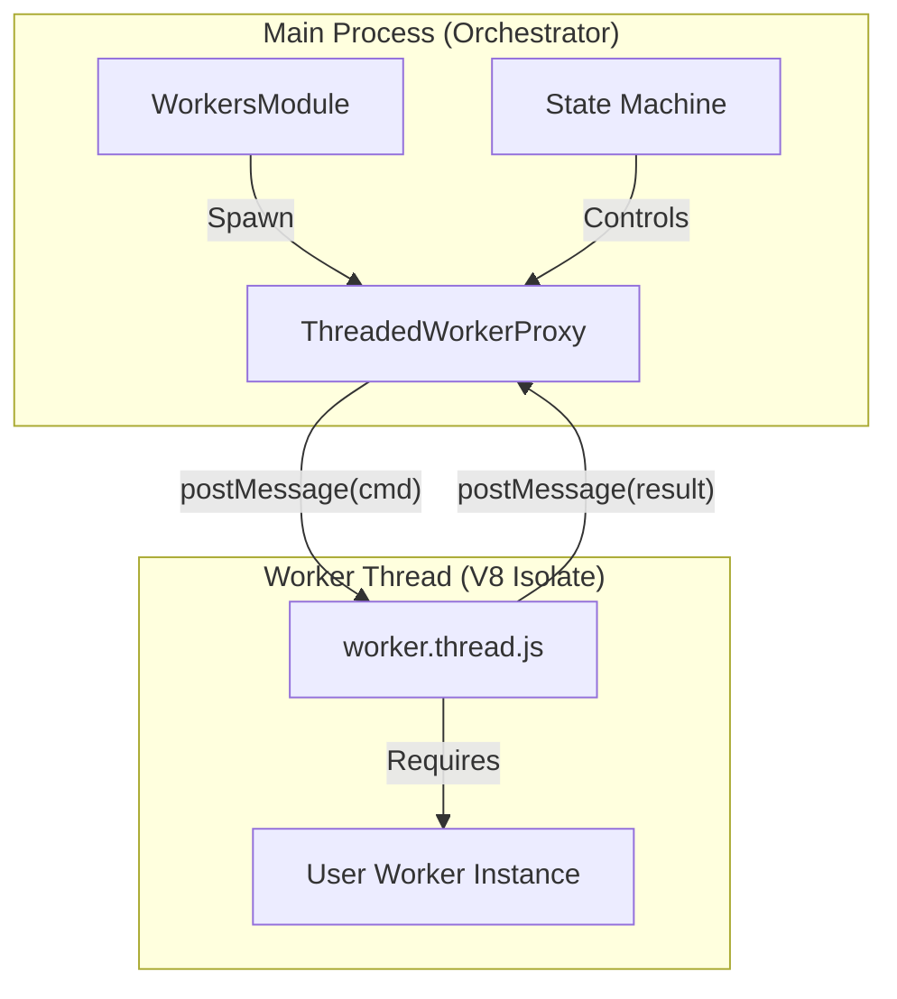

# Workers Architecture

> **Status**: Stable
> **Isolation**: Threaded (Default) / Process (Opt-in)
> **Module**: `[Loom]::[Workers]`

## Overview

The **Workers** system is a runtime within Link Loom designed to safely execute untrusted or resource-intensive business logic. It provides **"Bare-Metal" Isolation** by running each Worker instance in a dedicated Execution Unit (Worker Thread) separate from the Main Event Loop.

This architecture ensures:

1.  **Reliability**: A crash in a Worker does not crash the host.
2.  **Responsiveness**: CPU-bound tasks do not block the Orchestrator's I/O.
3.  **Sanitation**: Memory is fully reclaimed after every execution ("The Guillotine").

---

## 1. Architectural Model

The system follows a **Proxy-Worker** pattern.



### Components

- **WorkersModule**: The kernel that manages the registry and lifecycle. It decides _how_ to spawn a worker (Threaded vs In-Process) based on configuration.
- **ThreadedWorkerProxy**: A "Twin" object living in the Main Thread. It creates the Worker and facilitates all communication. It looks and acts like a local Worker instance.
- **worker.thread.js**: The bootstrap script running inside the thread. It reconstructs a minimal environment (mocked Console, Config) and loads the actual Worker code.

---

## 2. Threading Model & Isolation

We utilize **Node.js Worker Threads** (`worker_threads`), which provide a unique blend of isolation and performance.

| Feature           | In-Process (Legacy) | Threaded (Current/Default)               | Child Process             |
| :---------------- | :------------------ | :--------------------------------------- | :------------------------ |
| **Memory**        | Shared Heap         | **Isolated V8 Heap**                     | Isolated Process Memory   |
| **Variables**     | Shared              | **Private**                              | Private                   |
| **Communication** | Direct Call         | `postMessage` (Structured Clone)         | IPC / Pipes               |
| **Crash Safety**  | **None**            | **High** (Thread death != Process death) | **High**                  |
| **Startup Cost**  | ~0ms                | ~50ms (V8 Isolate boot)                  | ~200ms+ (OS Process boot) |

### "The Guillotine" (Memory Reclamation)

The primary mechanism for memory management is **Forceful Termination**.

1.  When a Worker completes or is stopped, the Proxy calls `worker.terminate()`.
2.  This instructs V8 to immediately halt execution in that Isolate.
3.  **Result**: The OS reclaims 100% of the memory allocated by that thread. No garbage is left behind. This makes it impossible for ephemeral workers to leak memory over time.

---

## 3. Data Race Prevention

Asynchronous communication introduces the risk of **Race Conditions** (e.g., sending a `stop` command before `activate` returns).

We mitigate this using a **Correlation ID Protocol**:

1.  **Request**: Proxy generates a monotonic `messageId` (e.g., `seq=42`).
2.  **Pending Map**: Proxy stores `{ 42: { resolve, reject } }` in a Map.
3.  **Execution**: Worker receives `{ id: 42, cmd: '...' }`.
4.  **Response**: Worker replies `{ id: 42, type: 'result', ... }`.
5.  **Resolution**: Proxy looks up `42` in the Map and resolves the specific Promise.

> **Safety**: Even if multiple commands are in flight, their responses never get mixed up.

---

## 4. Lifecycle States

A Worker moves through a strict State Machine (`WorkerStateMachine`).

- **Void**: Does not exist.
- **INACTIVE**: Loaded in memory (Worker Started), but idle. `onCreate()` called.
- **ACTIVE_BACKGROUND**: Performing work. `onActivate()` running.
- **TERMINATING**: Shutdown sequence initiated. `onTerminate()` called.
- **TERMINATED**: Worker killed via Guillotine. References dropped.

### Class Structure (Code Standard)

The `WorkerStateMachine` follows strict Link Loom Dependency Injection patterns:

```javascript
class WorkerStateMachine {
  constructor(dependencies) {
    /* Base Properties */
    this._dependencies = dependencies;
    this._console = dependencies.console;

    /* Custom Properties */
    this._app = dependencies.app;
    // ...

    /* Assignments */
    this._namespace = `[Loom]::[Workers]::[${this._name}:${this._alias}]`;
  }
}
```

---

## 5. Configuration

Isolation is **Enabled by Default**.

To opt-out (force legacy behavior for debugging), set `WORKERS_ISOLATION` in your project config:

```json
{
  "WORKERS_ISOLATION": "process"
}
```

---

## 6. Developer Guide

To create a compatible Worker, no special changes are needed. Write standard Loom Workers:

```javascript
class MyWorker {
  constructor(deps) {
    this.logger = deps.console;
  }

  async onActivate(ctx) {
    // CPU Intensive work here is SAFE
    this.logger.info('Working...');
  }
}
module.exports = MyWorker;
```

**Restriction**: You cannot access variables from the Main Process (e.g., `global.server`). You must rely on the passed `ctx` and `config`.

---

## 7. API Contract

To ensure interoperability and predictable behavior, all Workers must adhere to the following contract regarding Input Payloads and Return DTOs.

### 7.1 Input Payload (Execution Context)

When a Worker is executed (via `spawn` or `activate`), it receives a **Context (`ctx`)**. The execution payload is contained within `ctx.options`.

**Structure:**

```javascript
{
  phase: 'activate',     // Lifecycle phase
  name: 'my-worker',     // Worker Name
  alias: 'worker-001',   // Instance Alias

  // THE COMPUTE PAYLOAD
  options: {
    // Custom data passed by the caller
    cmd: 'process-file',
    filePath: '/tmp/data.csv',
    ...
  },

  logger: { ... }        // Remote logger proxy
}
```

### 7.2 Output DTO (Return Value)

Every Worker **MUST** return a DTO (Data Transfer Object) upon completion of its primary task (usually `activateBackground`).

**Standard Structure:**

```javascript
{
  // 1. Functional Result
  ok: true,              // Success flag
  data: { ... },         // Business logic result
  errors: [],            // List of errors if any

  // 2. Performance Metrics (Automatically injected by SDK)
  performance: {
    durationMs: "1250.40",
    cpu: {
      userMicros: 8500,
      systemMicros: 3200,
      utilization: "0.95%"
    },
    memory: {
      heapUsedDiff: "15.4 MB",
      externalDiff: "0 B",
      totalHeap: "32.1 MB"
    }
  }
}
```

> **Note**: For Threaded Workers, the `performance` object is automatically appended to your return value by the `ThreadedWorkerProxy`. You do not need to calculate it manually.
